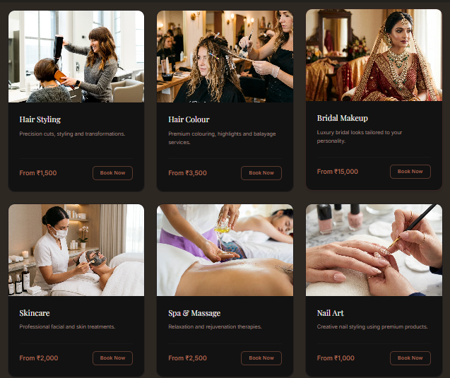
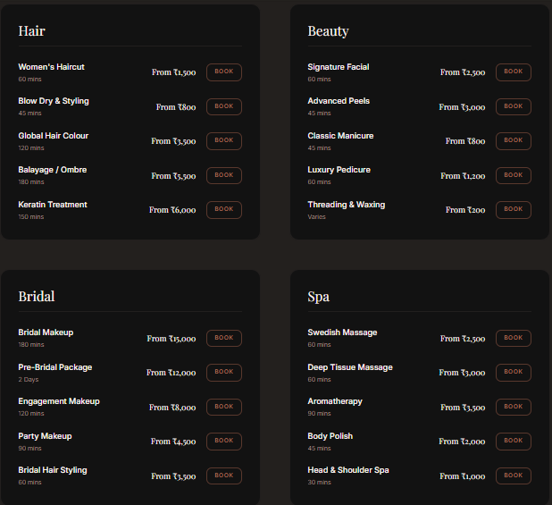
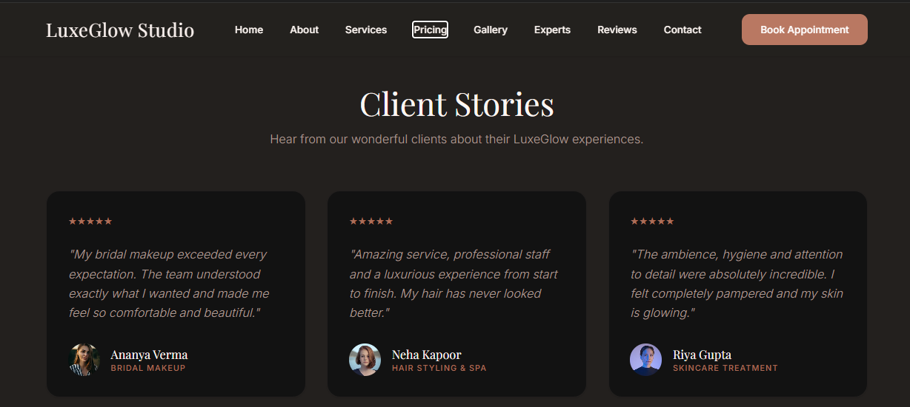
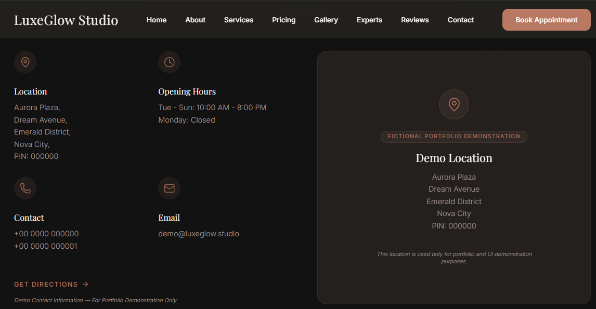

# ✨ LuxeGlow Studio

A premium luxury salon and wellness website designed with a modern, elegant, and responsive user experience.

Built using React, Tailwind CSS, and Framer Motion to deliver smooth animations, premium UI, and a mobile-first experience.

---

## 🌐 Live Demo

🔗 https://luxeglow-studio-609638214778.asia-southeast1.run.app

---

## 📸 Preview

### 🏠 Homepage


---

### 💇 Services Section



---

### 💰 Pricing



---

### ⭐ Testimonials



---

### 📞 Contact



---

### 📱 Mobile View


---

## 🚀 Features

- ✨ Premium Luxury UI
- 📱 Fully Responsive Design
- 🎬 Smooth Framer Motion Animations
- 💅 Luxury Services Showcase
- 💎 Elegant Pricing Plans
- ⭐ Customer Testimonials
- 📅 Appointment Booking Section
- 📍 Contact & Location Information
- 🌙 Modern Dark Theme
- ⚡ Optimized Performance

---

## 🛠️ Tech Stack

- React
- Tailwind CSS
- Framer Motion
- JavaScript (ES6+)
- HTML5
- CSS3
- Google AI Studio

---

## 📂 Project Structure

```text
src/
├── components/
├── pages/
├── assets/
├── hooks/
├── App.jsx
└── main.jsx
```

---

## 🎯 Project Goal

The objective of LuxeGlow Studio was to create a premium salon and wellness website that delivers an elegant user experience, modern UI design, smooth animations, and complete responsiveness across all devices.

---

## 📱 Responsive Design

Optimized for:

- 💻 Desktop
- 💼 Laptop
- 📱 Tablet
- 📲 Mobile

---

## ⚡ Performance

Designed with a focus on:

- Clean UI
- Responsive Layout
- Smooth Animations
- Modern Design Principles
- Accessibility
- Fast Loading Experience

---

## 📈 Future Improvements

- Online Appointment Booking
- User Authentication
- Admin Dashboard
- Payment Gateway Integration
- CMS Integration
- Multi-language Support

---

## 👨‍💻 Developer

**Vaibhav Bhardwaj**

- GitHub: https://github.com/vaibhavstudio

---

## ⭐ Support

If you like this project, please consider giving this repository a ⭐ on GitHub.
